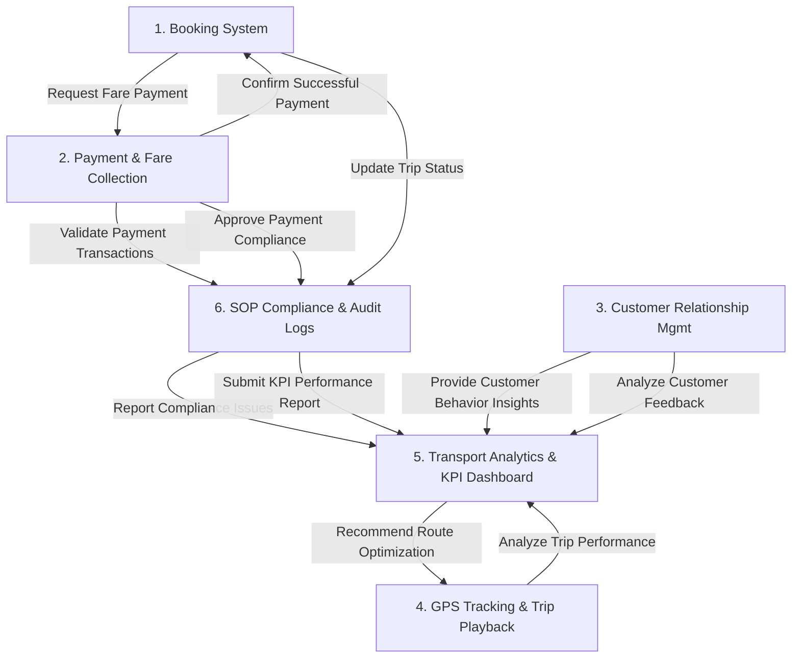

# BPA Data Flow & Team 10 Architecture Mapping

This document provides a 1-to-1 mapping of the **Business Process Architecture (BPA)** diagram assigned to **Team 10 (TNVS Booking, Payments & Customer Experience)**.

---

## 1. Team 10 Internal Module Workflows

---

## 2. Cross-Team Integration Mapping (BPA Arrows)

### A. Team 9: Operations & Driver Management
- **Arrow 1 (`Booking System ➔ Team 9: Dispatching & Trip Management`)**: *Submit Trip Request*
  - **In Code**: `POST /api/integrations.php?action=DISPATCH_TRIP_REQUEST` triggers when a passenger clicks "Book Ride Now", transmitting the pickup coordinates, dropoff location, and vehicle class.
- **Arrow 2 (`Team 9 ➔ Booking System`)**: *Dispatch Booking Information*
  - **In Code**: Team 9 returns the assigned driver (`Ricardo Dalisay`), vehicle plate (`NFD-8892`), and current driver GPS location.

### B. Team 5: Financial Management System (Transaction Core)
- **Arrow 3 (`Payment & Fare Collection ➔ Team 5: Accounts Receivable & General Ledger`)**: *Record Fare Collection*
  - **In Code**: `POST /api/integrations.php?action=RECORD_FARE_COLLECTION` sends the gross revenue, 12% VAT tax breakdown, and driver payout split directly to the General Ledger.
- **Arrow 4 (`Team 5 ➔ Payment & Fare Collection`)**: *Payment Confirmation*
  - **In Code**: Team 5 issues a ledger reconciliation code (`SYNCED_TO_GENERAL_LEDGER`).

### C. Team 8: Facilities & Administrative Management
- **Arrow 5 (`SOP Compliance & Audit Logs ➔ Team 8: Document Management & Contract Updates`)**: *Store Audit Documentation*
  - **In Code**: `POST /api/integrations.php?action=STORE_AUDIT_DOCUMENTATION` logs cryptographically verifiable audit proof hashes and driver franchise contract status.

### D. Team 3: Performance & Development
- **Arrow 6 (`Transport Analytics & KPI Dashboard ➔ Team 3: Performance Management & Training Management`)**: *Submit Driver Performance Report*
  - **In Code**: Transmits driver safety telemetry ratings (speeding flags, safety index 0-100%, and customer rating averages) to determine driver training recommendations.

### E. Team 7: Fleet & Transportation Management
- **Arrow 7 (`GPS Tracking & Trip Playback ➔ Team 7: Route Planning & Optimization`)**: *Update Route Progress & Vehicle Availability*
  - **In Code**: Transmits real-time vehicle coordinates and trip completion events so Team 7 knows when a vehicle is free for the next fleet assignment.
